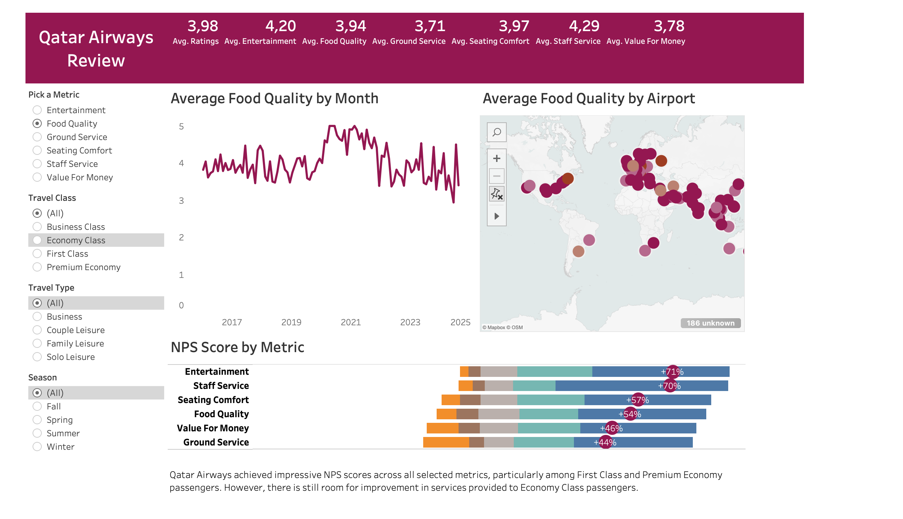

This is an end to end data science project that encompasses the entire process from start to finish. It begins with web scraping passenger reviews from [skytrax](https://www.airlinequality.com/review-pages/a-z-airline-reviews/), followed by cleaning and exploring the dataset. The next steps involve analyzing and visualizing the data to uncover key insights, and finally, building predictive models to forecast whether passengers would recommend Qatar Airways in the future.

The factors that play a significant role in passengers' likelihood of recommending Qatar Airways are:
- Ground Services,
- Seating Comfort,
- Staff Service,
- Food Quality,
- Entertainment

The importance of these features indicates that improvements in these areas could significantly enhance overall passenger satisfaction and recommendation rates.

The [Tableau Dashboard](https://public.tableau.com/app/profile/yonas.tena/viz/QatarAirwaysReviews_17242643659820/Dashboard1) highlights that Qatar Airways consistently achieved strong NPS scores across various metrics among its passengers. 

In summary, the airline emerged as a top performer in the industry, demonstrating high satisfaction and loyalty among its customers. This is particularly evident in its impressive NPS scores for Inflight Entertainment and Staff Service, which reached 71% and 70%, respectively.

